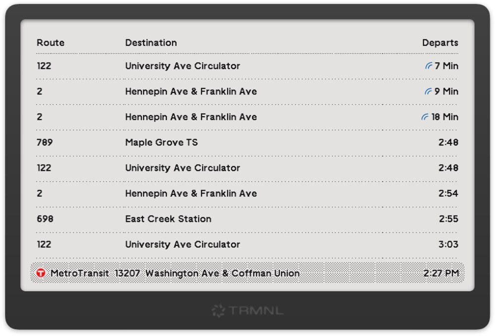

# TRMNL Metro Transit plugin

[TRMNL](https://usetrmnl) plugin to get the upcoming public transit departures for stops in the Minneapolis/St Paul metro.

## Setup
You can install this plugin via recipe: [https://usetrmnl.com/recipes/95919](https://usetrmnl.com/recipes/95919)

### Settings

| Setting | Description | Example |
| --- | --- | --- |
| **STOP ID** | You can find your closest Stop IDs using the [Metro Transit website](https://www.metrotransit.org/nextrip) | `13207` |
| **IGNORE ROUTES** | (Optional) Comma separated list of routes you don't wish to see | `3,Blue,A Line` |

## References
- [Metro Transit](https://www.metrotransit.org/)
- [NexTrip](https://www.metrotransit.org/nextrip)
- [NexTrip API](https://svc.metrotransit.org/swagger/index.html)